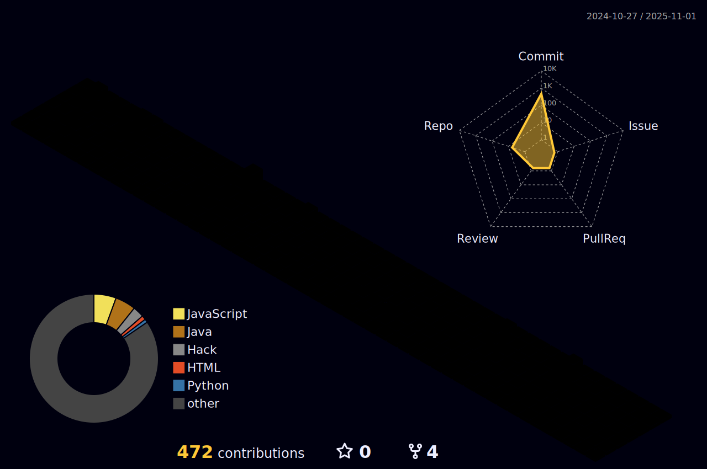

<!--
**gcw9438/gcw9438** is a ✨ _special_ ✨ repository because its `README.md` (this file) appears on your GitHub profile.

Here are some ideas to get you started:

- 🔭 I’m currently working on ...
- 🌱 I’m currently learning ...
- 👯 I’m looking to collaborate on ...
- 🤔 I’m looking for help with ...
- 💬 Ask me about ...
- 📫 How to reach me: ...
- 😄 Pronouns: ...
- ⚡ Fun fact: ...
-->
<!-- 
 -->

# Blog

# Stats
## BAEKJOON
 

  
  
 

 
## GitHub
 

  
  
 

<!-- github-profile-3d-contrib pos -->

  
# Tech Stack
## Language

  
  
  
  
  

## Back-End

  
  

  
  
## Front-End

 
### Web
 
 
### App
 
 
 

  

## DB

 

## DataScience / AI

  
  
  

## Tools

 
 
 
 
 

## Etc

  
  
  

## Studying...

  
  
  

  
<!-- 
 --> 
